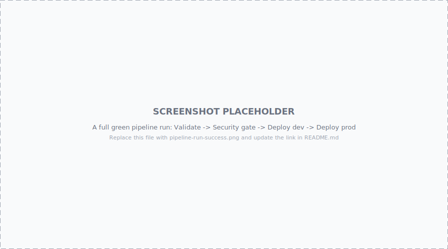
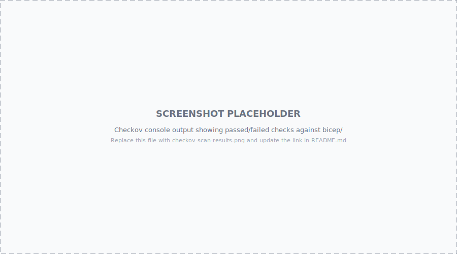
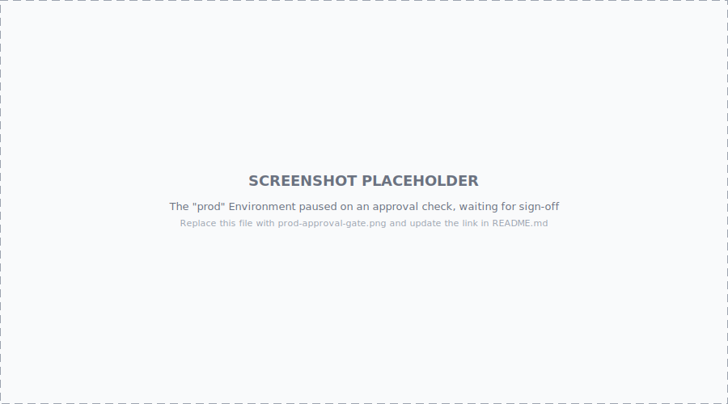

# securebicep

A hands-on reference for building Azure infrastructure the way you'd actually want it
built: a hub-and-spoke network, isolated Dev and Prod environments, and a pipeline that
refuses to deploy anything it hasn't scanned first. Everything here is modular Bicep,
and every design decision is explained so you can adapt it to your own environment
instead of copy-pasting blindly.

If you're here to learn how Checkov and PSRule fit into a real pipeline, or how a
hub-and-spoke topology actually enforces zero trust rather than just diagramming it,
this repo is for you.

## Two reference setups in one repo

This repo grew two independent pipelines rather than one, and that's deliberate:

| | `infra/` | `bicep/` |
|---|---|---|
| **What it deploys** | One resource group + one locked-down storage account, per environment | The full hub-and-spoke topology described below |
| **Pipeline file** | `azure-pipelines.yml` (repo root) | `bicep/azure-pipelines.yml` |
| **Auto-detected?** | Yes - Azure DevOps finds a root `azure-pipelines.yml` automatically when you create a new pipeline | No - has to be added as a second pipeline manually (see setup walkthrough below) |
| **Environments** | `dev` (also gates `DeployTest`), `prod` (approval required) | `dev`, `prod` (approval required) |
| **Why it exists** | Small enough to read end-to-end in a few minutes - useful for confirming the Checkov/PSRule gate itself works before trusting it with something bigger | The actual "here's what a production-shaped, zero-trust network looks like" reference |

Both pipelines deploy into the *same* subscription and deliberately reuse the
resource group names `rg-securebicep-dev` / `rg-securebicep-prod` - their resources
coexist rather than collide, since Bicep resource-group-scope deployments are
additive. `bicep/` additionally creates its own `rg-securebicep-hub`.

See [`docs/architecture.md`](docs/architecture.md) for diagrams of both the network
topology and each pipeline's stage flow.

## What's in here

```
infra/                          # Minimal reference sample
  main.bicep                     # Subscription-scope: creates its own resource group + storage account
  modules/storage-account.bicep
  main.parameters.{dev,test,prod}.json

bicep/                           # Hub-and-spoke reference architecture
  main.bicep                     # Subscription-scope orchestrator: hub + every spoke, one command
  hub/main.bicep                  # Shared hub network (vnet, firewall, bastion, DNS, logging)
  spoke/main.bicep                # Reusable spoke template - deployed once per environment
  modules/
    network/                      # nsg, vnet, peering, routeTable, firewall, bastion, private DNS
    storage/                      # zero-trust storage account
    monitoring/                    # Log Analytics workspace
  parameters/
    hub.bicepparam
    dev.bicepparam
    prod.bicepparam
  azure-pipelines.yml              # This architecture's own pipeline (see table above)
  ps-rule.yaml                      # PSRule.Rules.Azure config scoped to bicep/

scripts/
  setup-azure-devops.{sh,ps1}      # Provisions the ADO project, WIF service connection, dev/prod Environments
  teardown-azure-resources.{sh,ps1} # Deletes the billable resource groups (Firewall, Bastion, etc.)

docs/
  architecture.md                  # Diagrams: network topology + both pipelines' stage flow
  diagrams/                        # Hand-authored SVGs backing architecture.md
  screenshots/                      # Placeholders for real Azure DevOps screenshots

azure-pipelines.yml               # infra/'s pipeline: Validate -> Security gate -> Deploy dev/test -> Deploy prod
.checkov.yaml                      # Checkov configuration (scoped to bicep/)
ps-rule.yaml                       # PSRule.Rules.Azure configuration (scoped to infra/)
```

Every `.bicep` file under `modules/` does one thing and takes plain parameters - no
hidden magic, no shared state between modules. `hub/main.bicep` and `spoke/main.bicep`
compose those building blocks into the two halves of the topology, and `main.bicep`
composes *those* into the full stack when you want everything at once.

## The architecture


*(See [`docs/architecture.md`](docs/architecture.md) for this diagram alongside both
pipelines' stage-flow diagrams.)*

Dev and Prod are structurally identical - same modules, same NSG shape, same
private-endpoint pattern, same geo-redundant storage - they only differ in address
space and (in a real org) which subscription/service connection they live in. That symmetry is
intentional: security posture shouldn't be something you "remember" to add to Prod
later. It's baked into the module, so every environment gets it for free.

## Security first, not security eventually

It's tempting to build the network, get it working, and bolt on security controls
afterwards. This repo takes the opposite approach: every module ships with its
strictest reasonable defaults, and you have to deliberately loosen something to make
it less secure - not the other way around.

A few concrete examples from the code:

- **Storage accounts default to `publicNetworkAccess: 'Disabled'`.** The only path in
  is a private endpoint on the data subnet. There's no "we'll lock it down later" step.
- **`allowSharedKeyAccess` is `false`.** Access keys and connection strings simply
  don't work against these accounts - callers must authenticate with Azure AD
  (managed identity, ideally), so a leaked key can never be the incident.
- **NSGs default-deny.** Every NSG in this repo ends in an explicit `DenyAllInbound`
  / `DenyAllOutbound` rule at priority 4096. Azure already denies by default implicitly
  - we make it explicit anyway, so anyone reading the NSG (or a security review, or an
  auditor) can see the intent without having to know Azure's implicit rule set.
- **`checkov` and `ps-rule-assert` run before any deployment step, with
  `continueOnError: false`.** A failing scan stops the pipeline. There is no "ship now,
  fix later" lane.

## Layered security (defense in depth)

No single control here is meant to be the whole story. If one layer is misconfigured
or bypassed, another is there to catch it:

| Layer | Control | What it stops |
|---|---|---|
| Edge | Azure Firewall in the hub, egress rules scoped to known spoke ranges | Uncontrolled outbound traffic from any workload |
| Network | Subnet-level NSGs, explicit allow + explicit deny | Lateral movement between the app and data subnets, or from either subnet to the internet |
| Routing | User-defined routes forcing `0.0.0.0/0` through the firewall | A misconfigured NSG rule that would otherwise let traffic straight out to the internet |
| Segmentation | Spokes peer only to the hub, never to each other | A compromised Dev workload reaching Prod directly |
| Identity | Storage accounts require Azure AD auth; no shared keys | Credential theft turning into data access |
| Data path | Private endpoints only; public network access disabled | Internet-facing exposure of storage, even by misconfiguration |
| Visibility | Every NSG, storage account, and firewall ships logs to a centralized Log Analytics workspace | Blind spots - if something does get through, there's a trail |
| Pipeline | Checkov + PSRule gate every deployment | Insecure IaC reaching Azure in the first place |

Any one of these failing doesn't mean the environment is compromised - that's the
point of layering them.

## Zero trust, applied

"Zero trust" gets used as a buzzword a lot. Here's what it actually means in this
repo, concretely:

- **No implicit trust between spokes.** Dev and Prod are peered to the hub, not to
  each other. There is no network path from Dev to Prod that doesn't pass through the
  hub firewall, where it can be inspected, logged, and denied.
- **No implicit trust between subnets.** The app subnet can reach the data subnet on
  443 and nothing else; the data subnet accepts *only* from the app subnet. Neither
  subnet trusts "the vnet" as a whole.
- **No standing public exposure.** Nothing in this topology has a public IP except the
  firewall and Bastion themselves - the two resources whose entire job is to be a
  controlled front door. VMs are reached exclusively through Bastion; storage is
  reached exclusively through a private endpoint.
- **Verify explicitly, every time.** Storage access requires an Azure AD token, not a
  key that, once issued, is trusted forever. TLS 1.2 and HTTPS are enforced, not
  assumed.
- **Assume breach.** Centralized logging exists so that if a control does fail, you
  can find out - the WAF Security pillar calls this out explicitly, and it's why every
  module here wires into the same Log Analytics workspace instead of each one growing
  its own, easy-to-forget logging setup.

## How this maps to the Well-Architected Framework

| Pillar | How this repo addresses it |
|---|---|
| **Security** | Defense in depth as described above: firewall, NSGs, forced tunneling, private endpoints, Azure AD-only storage access, centralized logging. |
| **Reliability** | Storage blob versioning and soft delete are on by default, and every environment - Dev included - defaults to geo-redundant storage (`Standard_GRS`). Data resilience isn't a "Prod-only" concern here; it's the module default. |
| **Operational Excellence** | Fully modular Bicep with one template per concern, parameter files per environment, and a pipeline that validates (`bicep build`/`lint`) before it ever scans or deploys. |
| **Cost Optimization** | Firewall and Bastion are togglable (`deployFirewall` / `deployBastion`) so you can spin up a cheap Dev-only smoke test without paying for a full hub. Logging, DNS, and the firewall are centralized in the hub instead of duplicated per spoke, so adding an environment doesn't mean paying for a second copy of shared infrastructure. |
| **Performance Efficiency** | Hub-spoke keeps shared services (firewall, DNS, Bastion) centralized instead of duplicated per environment, so scaling a new environment means adding a spoke, not rebuilding shared infrastructure. |

This repo leans hardest on Security, since that's the point of the exercise - but the
other four pillars are never an afterthought.

## The pipeline, stage by stage

There are two pipelines - see [docs/architecture.md](docs/architecture.md) for a
diagram of each. Both gate every deploy behind Checkov + PSRule, and every deploy
step runs `az deployment group what-if` (or `az deployment sub what-if`) immediately
before the real `create`, so you always see exactly what's about to change first.

### `bicep/azure-pipelines.yml` - the hub-and-spoke architecture

Four stages, each running only if the previous one succeeded:

1. **Validate** - installs the Bicep CLI and runs `bicep build` on every top-level
   template (`hub/main.bicep`, `spoke/main.bicep`, `main.bicep`), plus `bicep lint`.
   This catches typos and type errors before you waste time scanning broken code.
2. **IaC_Compliance (`Verify Guardrails and Security`)** - the security gate:
   - **Checkov** scans every Bicep file for misconfigurations (public storage,
     missing TLS enforcement, overly-permissive NSGs, and so on) and emits a SARIF
     report as a build artifact.
   - **PSRule.Rules.Azure** expands the Bicep to ARM and evaluates it against
     Microsoft's own Well-Architected Framework rules, publishing results straight to
     the Azure DevOps Tests tab via NUnit output.
   - Both steps run with `continueOnError: false`. A failure here stops the pipeline
     cold - nothing gets a chance to deploy.
3. **DeployDev** - creates `rg-securebicep-hub` and `rg-securebicep-dev` (deployment
   jobs don't check out the repo by default, so this stage explicitly does
   `checkout: self` first), deploys the hub, captures its outputs (the firewall's
   private IP and the Log Analytics workspace ID), and deploys the Dev spoke using
   those values. No human approval required; Dev is meant to be cheap to iterate on.
4. **DeployProd** - re-uses the hub's outputs and deploys the Prod spoke, but only
   after a human approves the `prod` Environment check in Azure DevOps. Same
   templates as Dev, same guardrails, promoted deliberately rather than automatically.

### `azure-pipelines.yml` (root) - the `infra/` reference sample

Five stages: **Validate** -> **SecurityGate** (Checkov + PSRule, same idea as above
but scoped to `infra/`) -> **DeployDev** -> **DeployTest** (both under the `dev`
Environment, no approval) -> **DeployProd** (`prod` Environment, approval required).
`infra/main.bicep` is subscription-scoped, so it creates its own resource group -
no separate `az group create` step needed, unlike the `bicep/` pipeline.

### Setting this up end-to-end: Azure CLI + Azure DevOps + GitHub

This repo lives on GitHub, but both pipelines are written for Azure Pipelines - that's
a deliberate, common combination: GitHub for source and review, Azure DevOps for the
deployment pipeline. Here's the whole path from an empty Azure subscription to two
running pipelines, in order.

**Fast path:** `scripts/setup-azure-devops.ps1` (or `.sh`) automates steps 2-4 below
via `az` - the Azure DevOps project, the workload-identity-federation service
connection, and the `dev`/`prod` Environments. It's idempotent (safe to re-run) and
prints a manual reminder at the two points that genuinely can't be scripted:
authorizing the GitHub App, and picking who approves `prod`. The steps below are the
manual equivalent, useful if you want to understand or customize what the script does.

**1. Prep the subscription with Azure CLI**

```bash
az login
az account set --subscription "<your-subscription-id-or-name>"

# The templates deploy these resource types, so make sure the providers are registered
az provider register --namespace Microsoft.Network
az provider register --namespace Microsoft.Storage
az provider register --namespace Microsoft.OperationalInsights
az provider register --namespace Microsoft.Insights

# Confirm the Bicep CLI that ships with az is current
az bicep upgrade
az bicep version
```

**2. Create an Azure DevOps project, connect it to GitHub, and add both pipelines**

- Go to [dev.azure.com](https://dev.azure.com) and create an organization/project if
  you don't already have one.
- *Pipelines > New pipeline > GitHub.* The first time you do this you'll be prompted
  to install/authorize the **Azure Pipelines** GitHub App on your account or org - grant
  it access to this repository (`<owner>/securebicep`) specifically, not every repo you own.
- Select `securebicep` from the repository list. Azure DevOps finds the root
  `azure-pipelines.yml` (the `infra/` sample) automatically.
- Click *Review*, then **Save** (not *Run* yet - the service connection and
  Environments below need to exist first, or the first run will just fail at the
  deploy stages while Validate and the security gate still run fine).
- Repeat *Pipelines > New pipeline > GitHub > securebicep*, but this time choose
  **"Existing Azure Pipelines YAML file"** and select `bicep/azure-pipelines.yml` -
  this is the hub-and-spoke pipeline, and it's *not* auto-detected since only a root
  `azure-pipelines.yml` is. Save this one too.

**3. Create the Azure Resource Manager service connection**

This is what lets both pipelines' `AzureCLI@2` tasks act against your subscription -
one connection, shared by both. The zero-trust-friendly option is workload identity
federation - no client secret is ever generated or stored:

- *Project Settings > Service connections > New service connection > Azure Resource
  Manager > Workload identity federation (automatic)*.
- Pick your subscription, leave resource group blank (both pipelines create their own
  resource groups), and name the connection to match the `azureServiceConnection`
  variable at the top of each `azure-pipelines.yml` (`securebicep-service-connection`) -
  or rename the variable in both files to match whatever you called the connection.
- Grant it **Contributor** at the subscription scope. That's enough to create every
  resource group and everything inside them; it doesn't need Owner or User Access
  Administrator since this repo doesn't assign RBAC roles of its own.
- Check *Grant access permission to all pipelines* (or approve it for each pipeline
  individually when it first runs).

**4. Create the `dev` and `prod` Environments**

- *Pipelines > Environments > New environment* - create one named `dev` (kind: None)
  and one named `prod`. Both pipelines reference these same two Environments by name.
- Open `prod` > *Approvals and checks > + > Approvals* - add whoever should sign off
  before production changes, and save. Leave `dev` without any checks; that's what
  keeps it cheap to iterate on.

**5. Run it**

You can trigger either pipeline three ways, all equivalent:
- *Pipelines > (pipeline name) > Run pipeline* in the Azure DevOps UI.
- Push a commit to `main` on GitHub. The root pipeline's `trigger:` fires on any push;
  `bicep/azure-pipelines.yml`'s is scoped to changes under `bicep/**`.
- Open a pull request into `main` on GitHub. The `pr:` trigger runs Validate and the
  Checkov/PSRule gate as a status check on the PR (via the Azure Pipelines GitHub App),
  so reviewers see whether the change passes security scanning before they approve it -
  without deploying anything.

Watch the run in the Azure DevOps UI: the Checkov results are attached as a build
artifact (or shown inline, for the `bicep/` pipeline's CLI-based scan), PSRule's
findings show up in the pipeline's *Tests* tab, and `DeployProd` will sit paused
waiting for an approval from whoever you added in step 4.

**Tearing it down:** `scripts/teardown-azure-resources.ps1` (or `.sh`) deletes every
resource group both pipelines create - including Azure Firewall and Bastion, the two
real cost drivers - after a typed `DELETE` confirmation. It deliberately leaves the
Azure DevOps project, service connection, and Environments alone, so re-running the
pipelines later doesn't require redoing steps 2-4.

## Getting started locally

You don't need an Azure subscription to validate or scan this repo - only to actually
deploy it.

**Prerequisites:**
- [Bicep CLI](https://learn.microsoft.com/azure/azure-resource-manager/bicep/install) (bundled with a recent Azure CLI, or install standalone)
- [Checkov](https://www.checkov.io/2.Basics/Installation.html) (`pip install checkov`)
- [PSRule for Azure](https://azure.github.io/PSRule.Rules.Azure/) (PowerShell: `Install-Module -Name PSRule.Rules.Azure`)
- Azure CLI, if you intend to deploy

**Build and lint every template:**
```bash
find bicep -name '*.bicep' -not -path '*/modules/*' -exec bicep build {} --stdout \; > /dev/null
bicep lint bicep/main.bicep
```

**Run the same security gate the `bicep/` pipeline runs:**
```bash
checkov --config-file .checkov.yaml
```
```powershell
Invoke-PSRule -InputPath ./bicep -Module PSRule.Rules.Azure -Option ./bicep/ps-rule.yaml
```

**Or the `infra/` pipeline's gate** (CLI flags instead of a config file, and scoped
to `infra/` instead of `bicep/`):
```bash
checkov --directory infra --framework bicep --compact --quiet --skip-check CKV_AZURE_43
```
```powershell
Invoke-PSRule -InputPath ./infra -Module PSRule.Rules.Azure -Option ./ps-rule.yaml
```

**See what a full deployment would do, without changing anything:**
```bash
az deployment sub what-if \
  --location uksouth \
  --template-file bicep/main.bicep
```

**Deploy the whole stack yourself (hub + dev + prod, one subscription):**
```bash
az deployment sub create \
  --location uksouth \
  --template-file bicep/main.bicep
```

**Or deploy one piece at a time** (this is what the pipeline does, and it's the safer
habit to build - a Dev change should never require touching Prod's deployment):
```bash
az group create -n rg-securebicep-hub -l uksouth
az deployment group create -g rg-securebicep-hub \
  --template-file bicep/hub/main.bicep \
  --parameters bicep/parameters/hub.bicepparam

az group create -n rg-securebicep-dev -l uksouth
az deployment group create -g rg-securebicep-dev \
  --template-file bicep/spoke/main.bicep \
  --parameters bicep/parameters/dev.bicepparam \
  --parameters hubFirewallPrivateIp=<from-hub-output> logAnalyticsWorkspaceId=<from-hub-output>
```

## Screenshots

Real Azure DevOps screenshots go in [`docs/screenshots/`](docs/screenshots/README.md) -
currently placeholders, since they need an actual pipeline run to capture:

<p float="left">
  
  
  
</p>

## Lessons learned deploying this for real

This repo's history is the honest version of "it worked on the first try" - it
didn't. A few things that only surfaced once these pipelines actually ran against a
real subscription, in case you hit the same wall:

- **Deployment jobs don't check out the repo automatically.** Regular `job:` blocks
  do; `strategy.runOnce.deploy.steps` doesn't. Without an explicit `checkout: self` as
  the first step, every task that reads a repo file (a `.bicep` template, a
  `.bicepparam` file) fails with a "path not found" error that looks like a missing
  file, not a missing checkout.
- **`az deployment group create` never creates its own resource group.** Only
  subscription-scope deployments (`az deployment sub create`, like `infra/main.bicep`
  uses) do that. `bicep/`'s pipeline deploys at resource-group scope, so it runs
  `az group create` explicitly before every deployment.
- **Azure Bastion validates its subnet's NSG against an exact rule set** - see
  [Microsoft's documented requirements](https://learn.microsoft.com/azure/bastion/bastion-nsg).
  Scoping `AllowSshRdpOutbound` and `AllowAzureCloudOutbound`'s source to
  `VirtualNetwork` instead of `*` (Any) looks more restrictive and secure, but Azure's
  platform-side compliance check specifically requires the broader source and
  rejects the narrower one.
- **Checkov's Bicep parser can't resolve parameterized values.** `sku.name: sku` (a
  parameter reference) or a storage account name built from `uniqueString()` and
  string interpolation can't be evaluated statically, so Checkov sometimes fails a
  check that's actually satisfied at deploy time. `.checkov.yaml`'s `skip-check` list
  documents each case with why it's a false positive rather than silencing it blind.
- **Match the region to your subscription's policy.** An "allowed locations" policy
  will deny a deployment (and even the resource group itself) outside its permitted
  regions - `eastus` failed here where `uksouth` succeeded. Worth checking before
  assuming a region-related failure is a bug in the template.

## Where to take this next

This repo is a solid, honest starting point - not a finished product. A few things
worth doing before you'd call this production-ready in your own tenant:

- **Tighten the firewall rule.** The starter network rule allows HTTPS to `*` from
  spoke ranges so the reference architecture deploys cleanly out of the box. Replace
  it with application rules scoped to the specific FQDNs your workloads actually need.
- **Customer-managed keys.** Storage encryption currently uses Microsoft-managed keys.
  If your compliance regime requires it, add a Key Vault module and switch
  `keySource` to `Microsoft.Keyvault`.
- **Azure Policy.** Pair this pipeline with policy assignments (e.g. deny public IPs
  outside the hub) so the guardrails hold even for resources created outside this
  repo.
- **Firewall Policy resource.** This repo uses classic firewall rule collections for
  simplicity. A `Microsoft.Network/firewallPolicies` resource gives you rule
  reusability and DNS proxy features if you outgrow the basics here.

If you extend this, keep the same rule the rest of the repo follows: make the secure
choice the default, and make anyone who wants something less secure say so
explicitly, in code, where a reviewer can see it.
