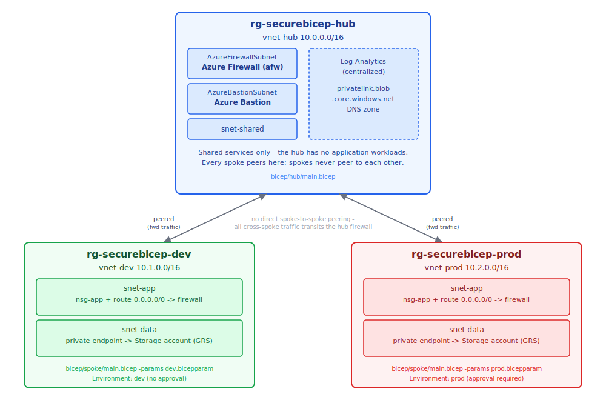
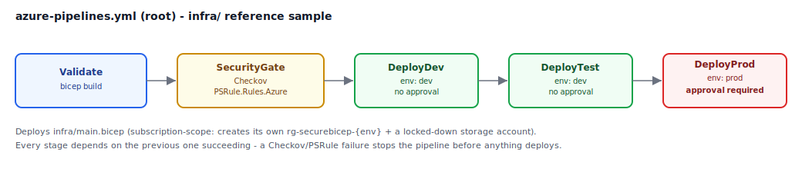
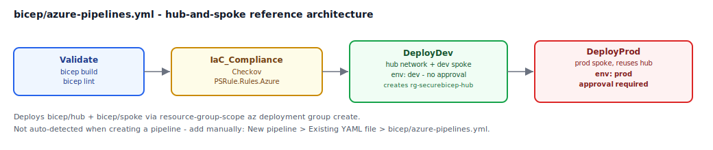

# Architecture

This repo ships two independent, complementary reference setups. They deploy into the
same subscription and deliberately share resource group names (`rg-securebicep-dev` /
`rg-securebicep-prod`), so their resources coexist rather than collide - see
[README.md](../README.md#two-reference-setups-in-one-repo) for why.

## Hub-and-spoke network (`bicep/`)

- **Hub** (`rg-securebicep-hub`) holds every shared service: Azure Firewall, Azure
  Bastion, the centralized Log Analytics workspace, and the private DNS zone every
  spoke resolves storage through. It has no application workloads of its own.
- **Dev and prod spokes** are structurally identical - same NSG shape, same
  private-endpoint pattern, same geo-redundant storage. They only differ in address
  space and which Environment gates their deployment.
- **No spoke ever peers to another spoke.** Traffic between dev and prod (or out to
  the internet) has no path that doesn't transit the hub firewall, where it can be
  inspected, logged, and denied.

Full narrative on why each control exists - defense in depth, zero trust, and the
Well-Architected Framework mapping - lives in the main [README.md](../README.md).

## Pipeline flow

Two separate Azure DevOps pipelines, each gated by Checkov + PSRule.Rules.Azure before
anything is allowed to deploy:

### `infra/` - minimal reference sample

Root `azure-pipelines.yml`. Deploys a resource group + a locked-down storage account
per environment - small enough to read end-to-end in a few minutes, useful for
verifying the security gate itself works before trusting it with something bigger.

### `bicep/` - hub-and-spoke reference architecture

`bicep/azure-pipelines.yml`. Deploys the full topology above. This file isn't
auto-detected when you create a new Azure DevOps pipeline (only a root
`azure-pipelines.yml` is) - see the setup walkthrough in the main README for how to
add it as a second pipeline.

## Diagram sources

The SVGs in `docs/diagrams/` are hand-authored, not exported from a design tool -
edit them directly if the architecture changes. Each is self-contained (no external
fonts or assets) so they render identically on GitHub, in an IDE preview, or opened
directly in a browser.
